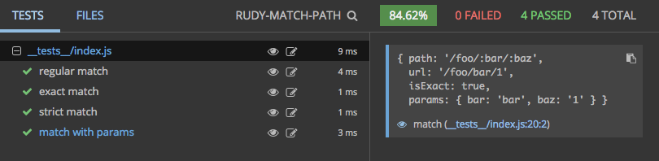

## `rudy-match-path`

This is the `matchPath` function borrowed from *React Router* for general purpose use. It's used by [Rudy](https://github.com/faceyspacey/rudy) and its [`<Link />` package](https://github.com/faceyspacey/rudy-link).

## Installation

```
yarn add rudy-match-path
```

## Usage

```js
import matchPath from 'rudy-match-path'

const { pathname } = window.location // '/foo/bar'
const isMatch = matchPath(pathname, { path: '/foo/:page', exact: true, strict: false })

<a className={isMatch && 'active'}>Foo</a>
```

## Contributing


We use [commitizen](https://github.com/commitizen/cz-cli), so run `npm run cm` to make commits. A command-line form will appear, requiring you answer a few questions to automatically produce a nicely formatted commit. Releases, semantic version numbers, tags, changelogs and publishing to NPM will automatically be handled based on these commits thanks to [semantic-release](https://github.com/semantic-release/semantic-release). Be good.


## Tests

Reviewing a package's tests are a great way to get familiar with it. It's direct insight into the capabilities of the given package (if the tests are thorough). What's even better is a screenshot of the tests neatly organized and grouped (you know the whole "a picture says a thousand words" thing). 

Below is a screenshot of this module's tests running in [Wallaby](https://wallabyjs.com) *("An Integrated Continuous Testing Tool for JavaScript")* which everyone in the React community should be using. It's fantastic and has taken my entire workflow to the next level. It re-runs your tests on every change along with comprehensive logging, bi-directional linking to your IDE, in-line code coverage indicators, **and even snapshot comparisons + updates for Jest!** I requestsed that feature by the way :). It's basically a substitute for live-coding that inspires you to test along your journey.



